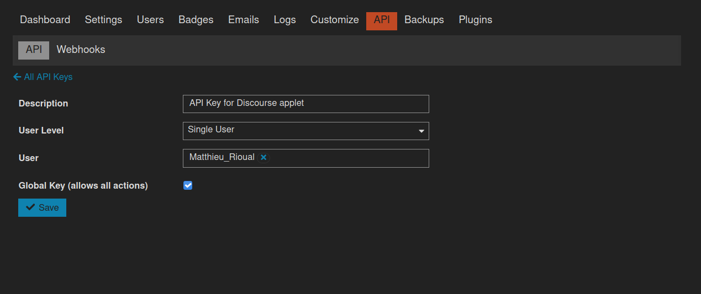

# Q Applet: Discourse notification warning (admin)

Make a key blinking when you have an unread notification.

[GitHub repository](https://github.com/matthieulapatate/daskeyboard-applet-discourse-admin)

## Requirements and setup

You need to have access to the forum /admin and create an API key with global access. To create such an API Key you have to go to your-forum.com/admin/key/new and give global access to the key.

## Example

The "N" key in the image below is green because you have no unread notifications

## Installation

Requires a Das Keyboard Q Series: www.daskeyboard.com and an access to the /admin panel of a discourse forum.

Installation, configuration and uninstallation of applets is done within
the Q Desktop application [https://www.daskeyboard.com](https://www.daskeyboard.com/q).

## Running tests
- Create an auth.json file looking like the template one and file the gaps
-   `yarn test`

## Contributions

Pull requests welcome.
