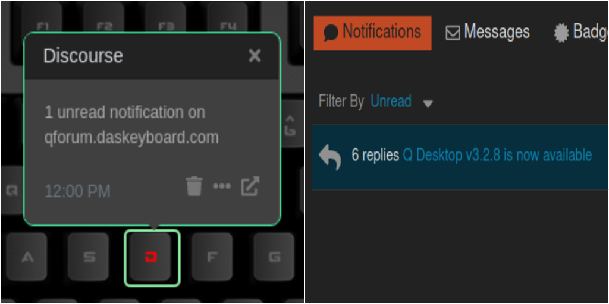

# Q Applet: Discourse

Displays Discourse admin notifications on a Das Keyboard Q Series.

Discourse is a open source forum.

For more informations about Discourse, visit <https://github.com/discourse/discourse>

This applet use Discourse [API](https://docs.discourse.org/).

[GitHub repository](https://github.com/daskeyboard/daskeyboard-applet--discourse)

## Changelog

[CHANGELOG.MD](CHANGELOG.md)

## Requirements and setup

You need to have access to the forum admin environment and create an API key with global access. To create such an API Key you have to go to your-forum.com/admin/key/new and give global access to the key.

## Installation

Requires a Das Keyboard Q Series: www.daskeyboard.com and an access to the /admin panel of a discourse forum.

Installation, configuration and uninstallation of applets is done within
the Q Desktop application [https://www.daskeyboard.com](https://www.daskeyboard.com/q).

## Running tests

- Create an auth.json file looking like the template one and add your values.
- `yarn test`

## Contributions

Pull requests welcome.

## Copyright / License

[LICENSE.MD](CHANGELOG)
